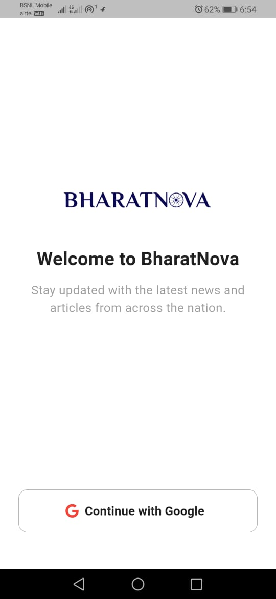
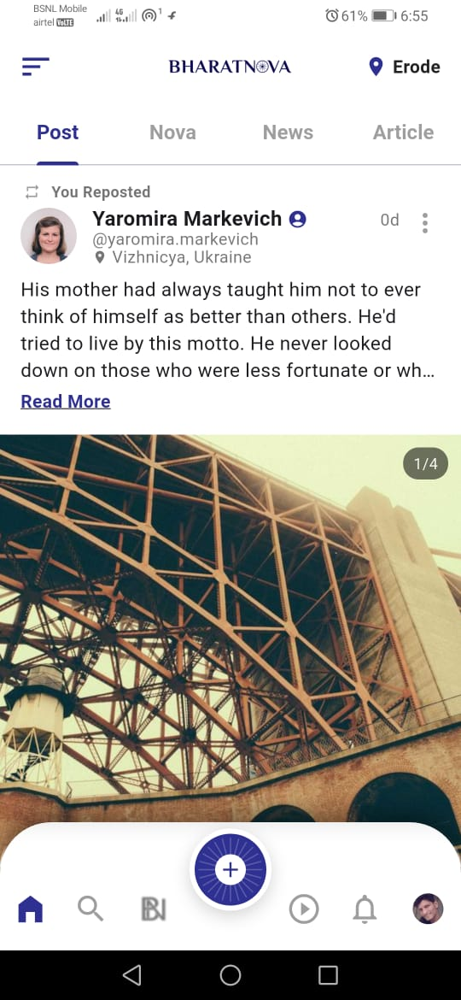

# 🇮🇳 BharatNova - Hyper-Local News Revolution

[](https://flutter.dev/)
[](https://firebase.google.com/)
[](https://riverpod.dev/)
[](https://dart.dev/)

**BharatNova** is a modern, high-performance news application designed to bring hyper-local updates directly to users. By leveraging real-time location services and a robust cloud backend, BharatNova ensures that you never miss what's happening in your immediate vicinity.

---

## 🌟 Key Features

- **📍 Hyper-Local News Feed**: Automatically detects user location to provide news that matters to their specific area.
- **🔐 Secure Authentication**: Integrated Google Sign-In and Firebase Auth for a seamless onboarding experience.
- **⚡ Real-time Updates**: Powered by Firebase Firestore/Realtime Database for instantaneous content delivery.
- **♾️ Infinite Scrolling**: Optimized pagination logic using Riverpod for a smooth, lag-free browsing experience.
- **🎨 Premium UI/UX**: Custom-designed widgets, shimmering loading states, and smooth transitions based on high-fidelity Figma designs.
- **📤 Easy Sharing**: Share impactful stories with friends and family with a single tap.
- **🌓 Adaptive Interface**: Clean, Material 3 design with focus on readability and accessibility.

---

## 🛠️ Tech Stack & Architecture

### Core Technologies
- **Frontend**: Flutter SDK (Stable Channel)
- **State Management**: `flutter_riverpod` (Modern, compile-safe reactive programming)
- **Backend**: Firebase (Authentication, Firestore, Realtime Database)
- **Location Services**: Geolocator & Geocoding API
- **Networking**: HTTP & Cached Network Image

### Architecture
The project follows a **Feature-First Architecture** (Modular approach), ensuring scalability and maintainability:
- `lib/features`: Contains isolated modules for Auth, Home, Splash, etc.
- `lib/services`: Global services for API calls and data persistence.
- `lib/models`: Strongly-typed data models for consistent data flow.
- `lib/widgets`: Reusable UI components across the application.

---

## 📸 Screenshots

| Splash Screen | Login Flow | News Feed |
|:---:|:---:|:---:|
|  |  |  |

---

## 🚀 Getting Started

### Prerequisites
- Flutter SDK (>= 3.8.1)
- Android Studio / VS Code
- Firebase Project Setup

### Installation
1. **Clone the repository**
   ```bash
   git clone https://github.com/Gobi6696/bharatnova.git
   ```
2. **Install dependencies**
   ```bash
   flutter pub get
   ```
3. **Firebase Configuration**
   - Place your `google-services.json` in `android/app/`
   - Place your `GoogleService-Info.plist` in `ios/Runner/`
4. **Run the app**
   ```bash
   flutter run
   ```

---

## 👨‍💻 Developer Skills Demonstrated
- **State Management**: Expert implementation of Riverpod for global state and local UI state.
- **API Integration**: Handling complex location-based queries and real-time data streams.
- **Clean Code**: Adherence to SOLID principles and DRY (Don't Repeat Yourself).
- **Responsive Design**: Building layouts that work across various screen sizes and orientations.

---

## 📬 Contact & Connect

- **GitHub**: [@Gobi6696](https://github.com/Gobi6696)
- **LinkedIn**: [Gobinath Shanmugam](https://www.linkedin.com/in/gobinath-shanmugam-244718152/)
- **Email**: gobinath6696@gmail.com

---
*Made with ❤️ in India by BharatNova Team*